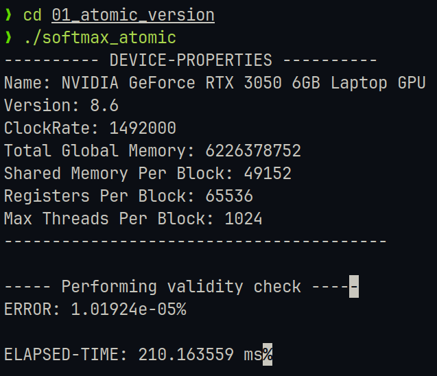
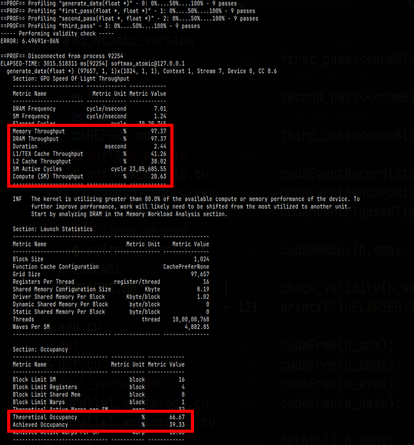
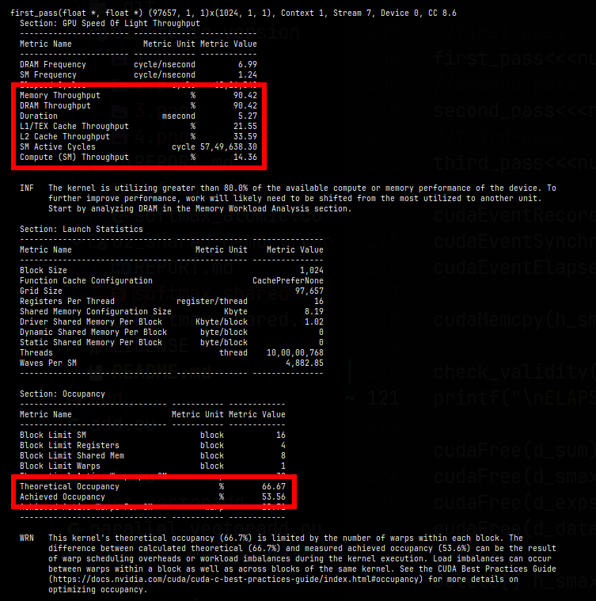
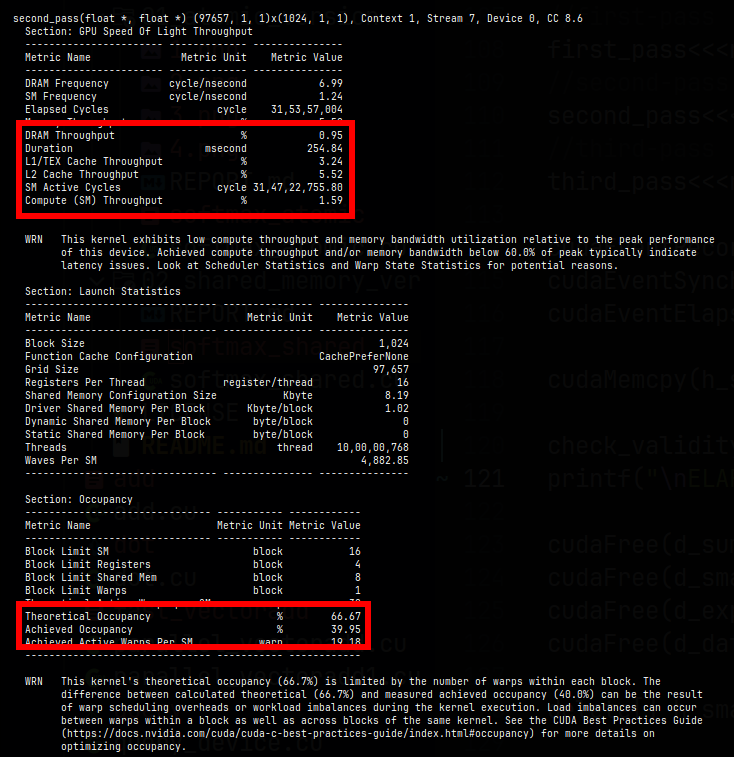
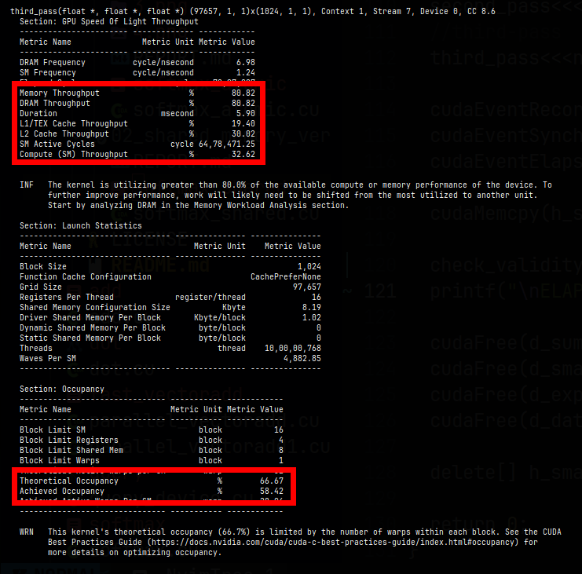

# Approach-1: Softmax with atomic (BASELINE)

# USAGE
```
    nvcc -lineinfo ./softmax_atomic.cu -o softmax_atomic
    ./softmax_atomic
```

## Features
1. Data genereted on the GPU.
2. Calculating softmax in 3-passes (calculate exponents -> calculate sum -> normalize).
3. Execution time: 210.163 ms for 100-Million elements.

## Bottlenecks
1. Current implementation is using atomic_add in the 2nd pass, each thread trying to access memory at the same time creates race conditions and limits throughput.
2. Every kernel reads/writes global memory directly. And no use of fast-shared memory.
3. Kernel occupancy ranges from 39.33% to 58.42%, which clearly shows underutilization of GPU resources.

## Result


### Nsight compute output & breakdown
#### [+] generate_data kernel

1. Memory and DRAM throughput is high (97.37%) as this method is generating data and utilizing memory. 
2. Compute throughput is low (20.63%). Which makes it clear that this kernel is memory-bound kernel.
3. Theorotical occupancy is 66.67% while we've achieved 39.33%. Which is hinting at underutilization of GPU.
#### [+] first_pass kernel

1. Memory and DRAM throughput are high (90.42%) as this method is computing exp(x) and utilizing memory.
2. Compute throughput is low (14.36%), due to the minimal compute required for calculating exp(x). And thus this kernel is memory-bound kernel. 
3. Theorotical occupancy is 66.67% while we've achieved 53.56%. Which is okay given the theoroticalvalue.
#### [+] second_pass kernel

1. Memory and DRAM throughput are low (0.95%) as this method is just responsible for atomically adding values and it isn't using much memory.
2. Compute throughput is 1.59% which is larger in comparision to memory throughput and thus this is a compute-bound kernel.
3. Theorotical occupancy is 66.67% while we've achieved 39.95%. Which is suggesting that there is underutilization of GPU.
#### [+] third_pass kernel

1. Memory and DRAM throughput is high (80.82%) as this method is normalizing the exp(x) values and storing them in memory.
2. Compute throughput is moderate (32.62%) as it is doing floating-point divisions. This suggests that this kernel is memory-bound.
3. Theorotical occupancy is 66.67% while we've achieved 58.42%, which is suggesting that this kernel is properly utilizing GPU.


