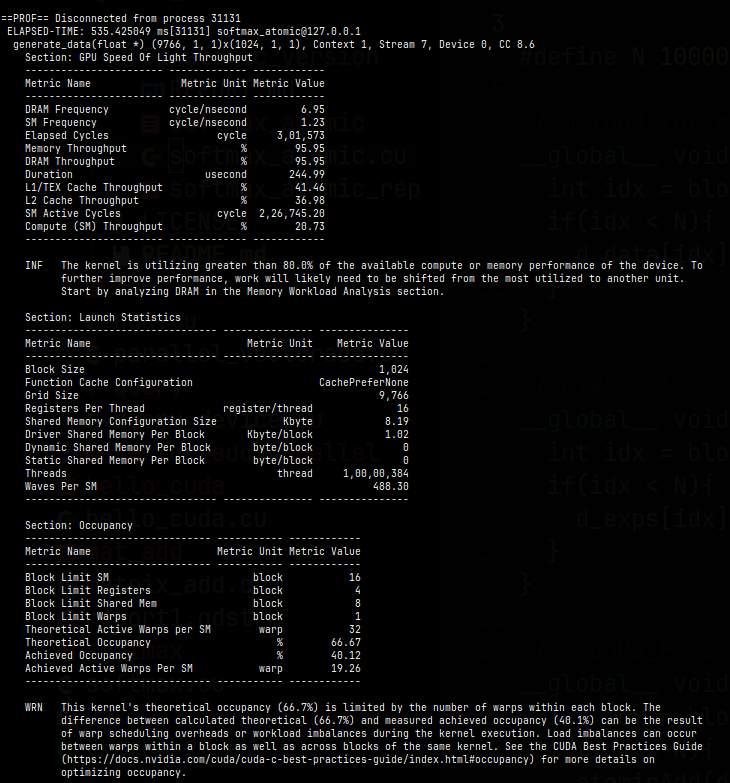
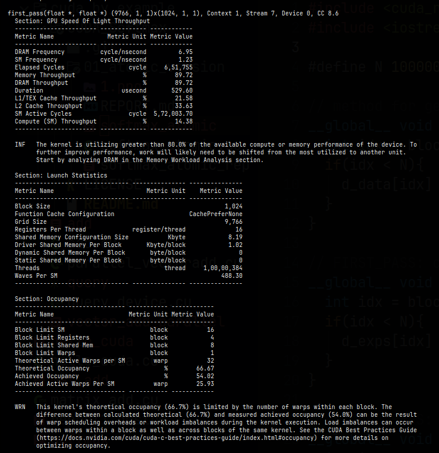
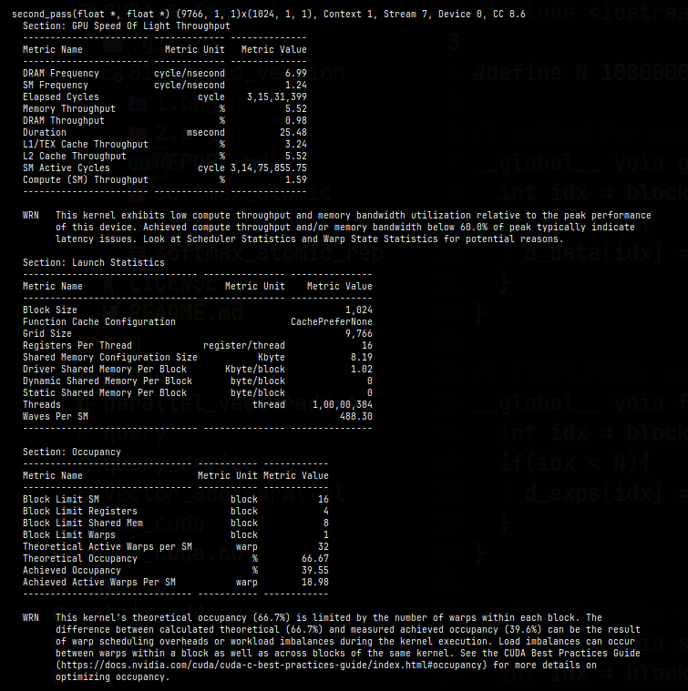
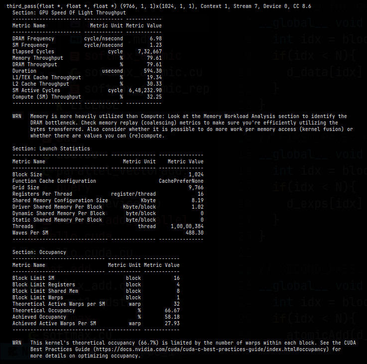

# SOFTMAX WITH ATOMIC APPROACH

# USAGE
```
    nvcc -lineinfo ./softmax_atomic.cu -o softmax_atomic
    ./softmax_atomic
```

## Features
1. Data genereted on GPU.
2. Calculating softmax in 3-passes (calculate exponents -> calculate sum -> normalize).
3. Execution time: 22.668287 ms for 10Million elements.

## Bottlenecks
1. Current implementation is usig atomic_add in the 2nd pass.
2. Each thread trying to access it at the same time creates race conditions and limits throughput.
3. This approach scales poorly for data more than 10Million and can be optimized using the shared memory available to each block, to improve performance.






