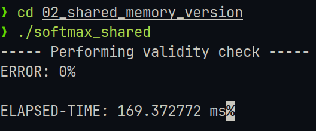
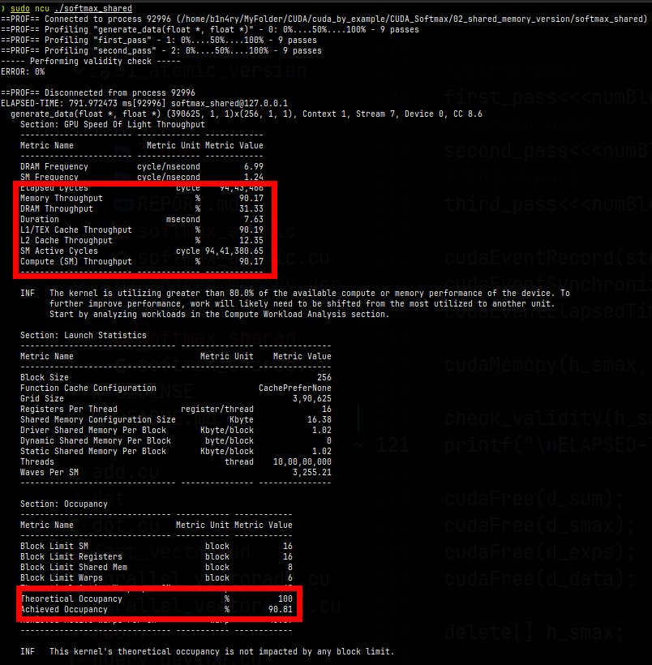
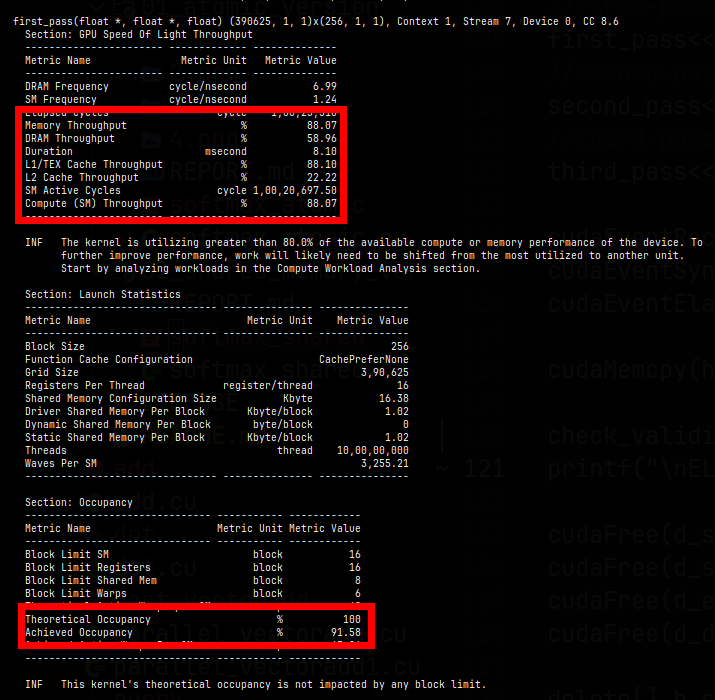
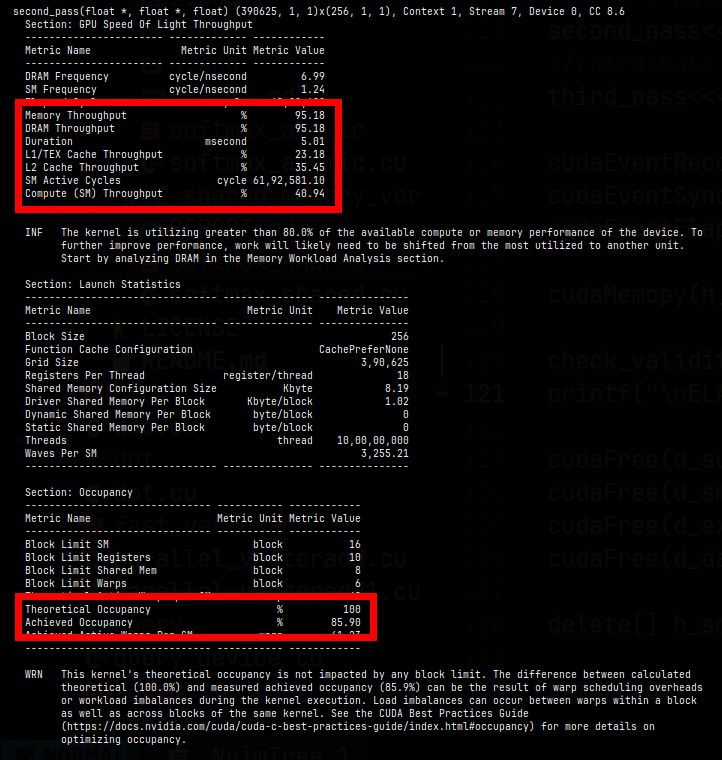

# Approach-2: Softmax with shared memory
This was my second attempt at creating/improving my previous softmax implementation which utilized atomic_add(). This implementation has given me the best performance so far, it is powered by shared memory, reduction steps and minimizing use of kernels and CPU-GPU data transfers.

# USAGE
```
    nvcc -lineinfo ./softmax_shared.cu -o softmax_shared
    ./softmax_atomic
```

## Features
1. Data generated on the GPU and in parallel the kernel also finds maximum value from data for each block. This merges two kernels into one.
2. Calculating softmax in 2-passes (calculate exponents + sum -> normalize). Which is utilizing 1 less pass as compared to the previous baseline-implementation. This was achieved by adding the sum functionality to the exponents kernel. I've ensured that there is no need for recomputation of any data.
3. Execution time: 169.372 ms for 100-Million elements. Which is a bit faster as compared to the baseline implementation. Providing ~20% speedup.
4. This implementation ensures a higher throughput due to reduced atomic contention.

## Bottlenecks
1. Still uses 2 passes for  calculating softmax.
2. Doesn't have warp-level optimizations.
3. Memory coalescing not so good.

## Result


#### [+] generate_data kernel

1. Memory and DRAM throughput is high and low (90.17% and 31.33%) respectively, as this method is generating data and utilizing memory. 
2. Compute throughput is high (90.17%). Which makes it clear that this kernel is compute-bound kernel, dominated by data calculation and comparisions.
3. Theorotical occupancy is 100% while we've achieved 90.81%. Which is hinting at proper of GPU.
#### [+] first_pass kernel

1. Memory and DRAM throughput is high and moderate (88.07% and  58.96%) respectively, as this method is computing exp(x) and sum, utilizing memory.
2. Compute throughput is high (88.07%), being dominated by expf() it is a compute-bound kernel.
3. Theorotical occupancy is 100% while we've achieved 91.58%. Which is great given the theoroticalvalue.
#### [+] second_pass kernel

1. Memory and DRAM throughput are high (95.18%) as this method is respinsible for normalizing the values and storing on memory.
2. Compute throughput is 40.94% which is moderate and hinting that this kernel is memory-bound due to the memory writes being the dominating factor.
3. Theorotical occupancy is 100% while we've achieved 85.90%. Which is good, suggesting that there is proper utilization of GPU.

## Improvements for next version
1. Use warp-level optimizations.
2. Try to implement softmax in a single pass.
3. Vectorization of data.

