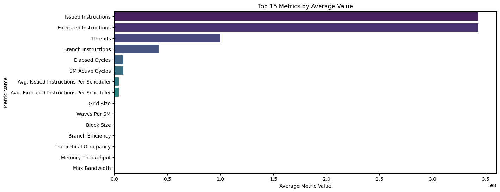

# CUDA_Softmax

I've used CUDA earlier in my OpenGL particle simulations, for updating particle properties in real-time. But, this was my first time implementing Softmax using CUDA. I've adopted a progressive approach for implementing this function. 

1. At first I implemented softmax, using 3-pass kernels, but it used atomic adds which severly affected the performance of the implementation and introduced race-conditions. Feel free to go through the [report](https://github.com/AayushBade14/CUDA_Softmax/blob/main/01_atomic_version/REPORT.md) and take a look at the plots below which are plotted using data generated using NVIDIA ncu.

2. The second implementation came with huge performance improvements, the setbacks in the first approach motivated me to learn and read about shared memory. And this implementation makes use of shared memory, uses reduction method for calculating maximum value and sum of values. Effectively reducing the complexity from O(n) to O(log2n). This implementation is ~20% faster than the first one. Feel free to go through the [report](https://github.com/AayushBade14/CUDA_Softmax/blob/main/02_shared_memory_version/REPORT.md) and take a look at the plots given below.

### The 2nd implementation is still not the most optimal, to push the boundaries further I'm working my way through the warp-level optimizations.
